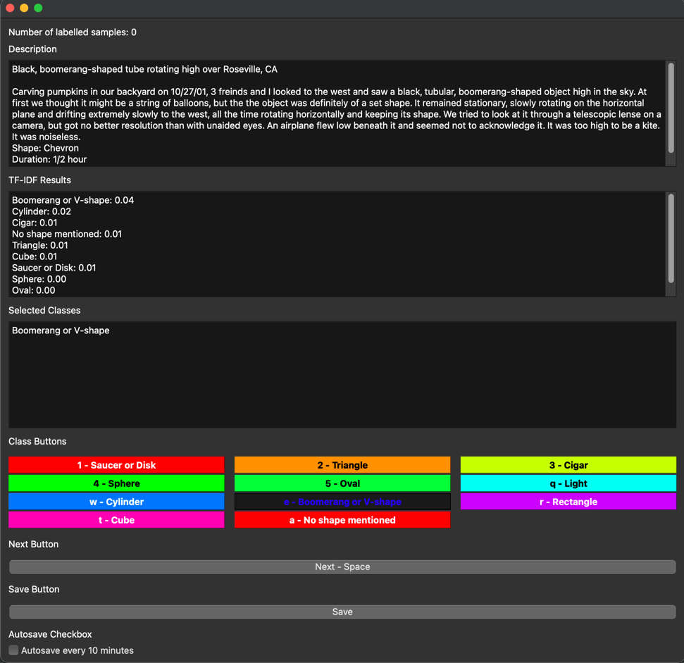

# Lazy Labeler

Lazy Labeler is a Python-driven desktop application designed to simplify the task of manually labeling datasets for machine learning projects. It presents an interactive interface, enabling users to label data samples with pre-established classes conveniently and swiftly. Although it was primarily developed as a personal tool and may not be suited for handling an exceptionally large number of labels at the moment (even though it can display them, it negates the quick hotkey labeling feature), it still holds potential usefulness for others. Additionally, it served as a learning opportunity to become more proficient in PyQt6, even though there are superior alternatives available.

To use the Lazy Labeler application, follow these steps:

### Installation

1. Clone the repository from GitHub:

```
git clone https://github.com/exampleuser/lazy-labeler.git
cd lazy-labeler
```

2. Create a new virtual environment (optional but recommended):

```
python -m venv venv
```

3. Activate the virtual environment:

- On Windows:

```
venv\Scripts\activate
```

- On macOS and Linux:

```
source venv/bin/activate
```

4. Install the required dependencies using `pip`:

```
pip install -r requirements.txt
```

### JSON Format for Synonyms

This project was originally for labelling data that had the shape of an object as the classes, you can provde synonyms for each class in a JSON file. 

The synonyms JSON file should be formatted as follows:

```json
{
    "Class 1": ["Synonym 1", "Synonym 2", "Synonym 3", ...],
    "Class 2": ["Synonym 1", "Synonym 2", "Synonym 3", ...],
    "Class 3": {"Class_3_subcategory":  ["Synonym 1", "Synonym 2", "Synonym 3", ...],
                "Class_3_subcategory_2":  ["Synonym 1", "Synonym 2", "Synonym 3", ...], ...},
}
```
In my example one class could be comprised of multiple subcategories, so I used a dictionary to represent this.
Each class should have an associated list of synonyms. The synonyms will be used during the labeling process to suggest labels to the user based on the TF-IDF similarity between the sample and the class synonyms.


## Technologies Used

The Lazy Labeler application is built using the following technologies:

- **Python**: The core programming language used for the application.
- **PyQt6**: A set of Python bindings for The Qt Company’s Qt application framework used to create the graphical user interface.
- **Pandas**: A Python library used for data manipulation and analysis. It is used to load, modify, and save the dataset in CSV format.
- **SQLite w/sqlAlchemy**: A lightweight disk-based database. To store, retrieve, and manipulate tasks.
- **Threading**: The application makes extensive use of QThreads for any blocking operations, such as loading and saving data and generating the TF-IDF vectors.
- **Sci-kit Learn**: A Python library used for machine learning. It is used to compute the TF-IDF vectors and cosine similarity between samples and class synonyms.
## TF-IDF and Text Labeling

TF-IDF (Term Frequency-Inverse Document Frequency) is a numerical statistic used in information retrieval to reflect how important a word is to a document in a corpus. It is used in the Lazy Labeler application to provide guidance to the user during the labeling process.

When labeling a sample, the application computes the cosine similarity between the TF-IDF vectors of the sample and a set of synonyms for each class. The class with the highest similarity is suggested to the user, helping to speed up the labeling process. 

This feature is especially useful when the number of classes is large and/or the distinctions between classes are subtle. The TF-IDF results are displayed in real-time as the user navigates through the samples.

### Labeling Process and Hotkeys

1. Start the Lazy Labeler application.

2. Create a new labeling task or continue an existing one. Specify the data file (in CSV format) containing the samples to label. Optionally, provide the labels file (in JSON format) with class synonyms.

3. Once you're in a labeling task, the application will present data samples one by one. For each sample, use the hotkeys (keyboard shortcuts) to select the appropriate label(s) based on the displayed classes:

   - Press the corresponding hotkey (e.g., 1, 2, 3) to select the class label. The key for each class key is noted on the button.
   - Press the spacebar to go to the next sample.
   - Click the save button to save any labels created.
   
4. The application will suggest labels based on the computed TF-IDF similarity between the sample and the class synonyms. These suggestions aim to speed up the labeling process.

5. As you navigate through samples and label them, the progress will be saved automatically every 10 minutes (autosave feature). Additionally, you can manually save your progress at any time.

